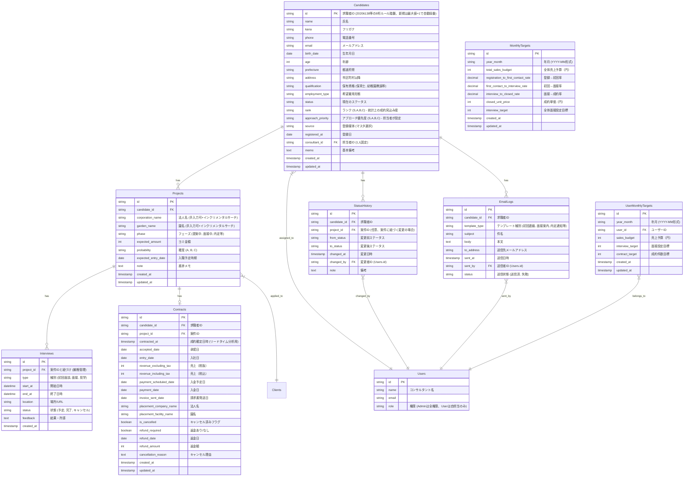

# データモデル設計書 (ER図)

現状の分散したCSVデータを正規化し、リレーショナルデータベースとして再設計する。

## 1. ER図概略

### Usersと認証の紐付け
*   **紐付けキー**: Supabase Authの`user.email`と`users.email`を一致させる
*   **権限判断**: `users.role`をAPI/画面の認可判定に使用

## 2. 移行マッピング定義

### A. Candidates (求職者マスタ)
データの源泉: `元データ/求職者管理 - 連絡先一覧.csv` をベースに、月次の状況は `【保育】数値管理シート_最新版 - 全メンバーマージシート.csv` で補完する。

| 新DB項目 | 移行元CSV項目 (例) | 備考 |
| :--- | :--- | :--- |
| id | ID | `2020xxxx`形式を踏襲。重複時は警告 |
| name | 氏名 | |
| phone | 電話番号 | ハイフン除去などで正規化 |
| email | メールアドレス | |
| birth_date | 生年月日 | |
| address | 都道府県 + 市区町村 | |
| qualification | 保育資格 | カンマ区切り等を配列化検討 |
| source | 媒体 | マスタ必須項目 |
| registered_at | 登録日 | |
| **rank** | (なし) | **統計上の成約見込み度（S/A/B/C）。登録時に自動算出** |
| **approach_priority** | (なし) | **アプローチ優先度（S/A/B/C）。担当者が手動で設定** |

**ランクとアプローチ優先度の違い**:
- `rank`: 統計データに基づく成約見込み度。登録情報（資格、希望条件、媒体等）から自動算出。「成約しやすそうな人」を示す。
- `approach_priority`: 担当者が初回ヒアリング後に設定する対応優先度。「今すぐアプローチすべき人」を示す。

### B. Projects (進捗・案件)
データの源泉: `【保育】数値管理シート_最新版 - 全メンバーマージシート.csv`（月次スナップショット）と
`元データ/メンバーシート/*.csv`（園名・法人名などの詳細）を統合する。

| 新DB項目 | 移行元CSV項目 (例) | 備考 |
| :--- | :--- | :--- |
| candidate_id | ID | マスタと紐づけ |
| phase | ステータス | "面接フェーズ", "提案フェーズ" 等 |
| probability | ヨミ確度 / ランク | "Aヨミ", "B" 等 |
| expected_amount | ヨミ金額 / 手数料 | 数値型に変換 |
| corporation_name | 法人名 | 手入力可 |
| garden_name | 提案園 / 園名 | 手入力可 |

### C. Interviews (面接ログ)
データの源泉: `元データ/メンバーシート/*.csv` の「面接フラグ日」「面接日」を正として扱う。

| 新DB項目 | 移行元CSV項目 (例) | 備考 |
| :--- | :--- | :--- |
| project_id | (なし) | **案件（projects）作成後に candidate_id で紐づける** |
| candidate_id | 氏名 | 移行時は氏名マッチングで紐づけ |
| start_at | 日付 + 時間 | |
| type | カテゴリ (面接, 面談) | |
| feedback | 内容 / 備考 | |

**面接先**: 面接先（園名/法人名）は `Projects.garden_name` と `Projects.corporation_name` を参照する。

### D. StatusHistory (ステータス変更履歴)
**タイムライン表示・リードタイム分析用の履歴テーブル（新規作成）**

| 新DB項目 | 用途 | 備考 |
| :--- | :--- | :--- |
| id | 主キー | UUID自動採番 |
| candidate_id | 求職者ID | Candidates.idへのFK |
| project_id | 案件ID | Projects.idへのFK（任意） |
| from_status | 変更前ステータス | 例: "未対応" |
| to_status | 変更後ステータス | 例: "連絡中" |
| changed_at | 変更日時 | タイムスタンプ |
| changed_by | 変更者 | Users.idへのFK |
| note | 備考 | 任意 |

**分析可能なリードタイム例**:
- 登録→初回ヒアリング: `初回ヒアリング日時 - registered_at`
- 初回ヒアリング→提案: `提案開始日時 - 初回ヒアリング完了日時`
- 提案→面接: `面接日時 - 提案開始日時`
- 面接→内定: `内定日時 - 面接日時`
- 内定→成約: `成約日時 - 内定日時`
- **全体リードタイム**: `成約日時 - registered_at`

### E. EmailLogs (メール送信履歴)
**タイムライン表示用のメール履歴テーブル（新規作成）**

| 新DB項目 | 用途 | 備考 |
| :--- | :--- | :--- |
| id | 主キー | UUID自動採番 |
| candidate_id | 求職者ID | Candidates.idへのFK |
| template_type | テンプレート種別 | 初回連絡、面接案内、内定通知等 |
| subject | 件名 | |
| body | 本文 | |
| to_address | 送信先 | |
| sent_at | 送信日時 | タイムスタンプ |
| sent_by | 送信者 | Users.idへのFK |
| status | 送信状態 | 送信済、失敗 |

### F. Contracts (成約テーブル)
データの源泉: `【自動更新】成約データ - 2025_10.csv`等

| 新DB項目 | 移行元CSV項目 (例) | 備考 |
| :--- | :--- | :--- |
| candidate_id | ID | マスタと紐づけ |
| project_id | (なし) | 案件IDへのFK（新規追加） |
| **contracted_at** | (なし) | **成約確定日時（リードタイム分析用、新規追加）** |
| accepted_date | 承諾日 | |
| entry_date | 入社日 | 入社日（新規追加） |
| revenue_excluding_tax | 売上（税抜） | 数値型 |
| revenue_including_tax | 売上（税込） | 数値型 |
| payment_date | 入金日 | |
| payment_scheduled_date | 入金予定日 | |
| invoice_sent_date | 請求書発送日 | |
| placement_company_name | 法人名 | |
| placement_facility_name | 園名 | |
| is_cancelled | (なし) | キャンセル済みフラグ（新規追加） |
| refund_required | (なし) | 返金あり/なしフラグ（新規追加） |
| refund_date | (なし) | 返金日（新規追加、返金ありの場合のみ） |
| refund_amount | (なし) | 返金額（新規追加、返金ありの場合のみ） |
| cancellation_reason | (なし) | キャンセル理由（備考、新規追加） |

**入社キャンセル対応機能**:
- 成約後に入社を辞退した場合、キャンセル情報を管理する
- `is_cancelled`: キャンセル済みかどうか（boolean）
- `refund_required`: 返金あり/なし（boolean）
- `refund_date`: 返金日（返金ありの場合のみ必須）
- `refund_amount`: 返金額（返金ありの場合のみ必須）
- `cancellation_reason`: キャンセル理由（任意）

### G. MonthlyTargets (月次目標テーブル)
**全体の月次目標を管理するテーブル（新規作成）**

| 新DB項目 | 用途 | 備考 |
| :--- | :--- | :--- |
| id | 主キー | UUID自動採番 |
| year_month | 年月 | YYYY-MM形式（例: 2026-01） |
| total_sales_budget | 全体売上予算 | 円単位 |
| registration_to_first_contact_rate | 登録→初回率 | 目標値（0.65 = 65%） |
| first_contact_to_interview_rate | 初回→面接率 | 目標値（0.80 = 80%） |
| interview_to_closed_rate | 面接→成約率 | 目標値（0.60 = 60%） |
| closed_unit_price | 成約単価 | 円単位（例: 600000） |
| interview_target | 全体面接設定目標 | 件数（例: 8） |
| created_at | 作成日時 | タイムスタンプ |
| updated_at | 更新日時 | タイムスタンプ |

**UNIQUE制約**: `year_month` で月ごとに1レコードのみ

### H. UserMonthlyTargets (メンバー別月次目標テーブル)
**メンバー別の月次目標を管理するテーブル（新規作成）**

| 新DB項目 | 用途 | 備考 |
| :--- | :--- | :--- |
| id | 主キー | UUID自動採番 |
| year_month | 年月 | YYYY-MM形式（例: 2026-01） |
| user_id | ユーザーID | Users.idへのFK |
| sales_budget | 売上予算 | 円単位（個人目標） |
| interview_target | 面接設定目標 | 件数（個人目標） |
| contract_target | 成約件数目標 | 件数（個人目標） |
| created_at | 作成日時 | タイムスタンプ |
| updated_at | 更新日時 | タイムスタンプ |

**UNIQUE制約**: `(year_month, user_id)` で月ごと・ユーザーごとに1レコードのみ

**対象ユーザー**: コンサルタント（role='user'）のみを対象とし、管理者（role='admin'）は除外

## 3. データベース技術選定
*   **Supabase (PostgreSQL)**
    *   リレーショナルデータとしての整合性担保。
    *   JSONB型を使った柔軟な「備考・属性」管理（項目変更に強い）。
    *   リアルタイム機能（誰かが編集したら即座に画面反映）。

